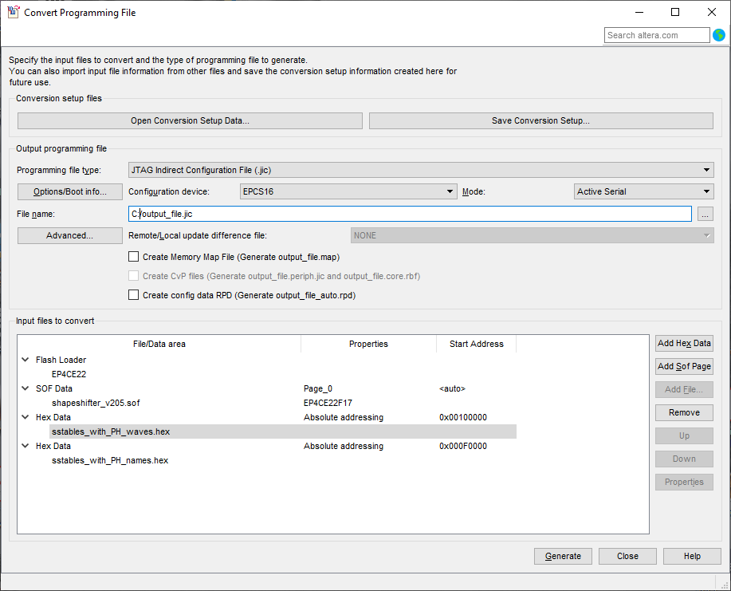

# sspatcher

Utility for extracting and replacing wavetables in the Intellijel Shapeshifter eurorack module EEPROM image.

These tools are built to work with .bin firmware images (the old way), and will not work with the newer .jic images as provided on the Intellijel website. It's not possible to work with the .jic files directly due to a proprietary encryption scheme.

## Getting started

This script doesn't require any additional libraries unless you want to use the Intel hex generation command. For that, please run the following commands to install `intelhex`:

```bash
python3 -m venv ./env
. env/bin/activate
pip install -r requirements.txt
```

## Commands

```
usage: sspatcher.py [-h] [-i IMAGE] [-d [DIRECTORY]] (-e | -p | -x)

optional arguments:
  -h, --help            show this help message and exit
  -i IMAGE, --image IMAGE
                        Name of the Shapeshifter EEPROM image file.
  -d [DIRECTORY], --directory [DIRECTORY]
                        Directory where extracted wavetable data will be written. If it doesn't exist, it will be created. Default:
                        sstables
  -e, --extract         Extract wavetables from the image.
  -p, --patch           Patch the image file with new wavetables.
  -x, --intelhex        Derive wavetables and names from directory of files, and write to IntelHex format.
```

## How to merge .sof and .hex files to make new .jic file

Flashing Shapeshifter with a .jic file is MUCH faster than the old method that used a .bin file. Here's how you can create a .jic file from a .sof file and one or more .hex files.

- Generate .hex files with name and wave data using the `intelhex` function in this script. This function expects a directory with 128 .raw audio files. Beware Shapeshifter's naming quirks. This script's `extract` function generates suitable files, given a correct Shapeshifter .bin firmware file.
- Use the `Convert Programming File` command in Quartus Prime to merge the .sof file and .hex files generated in the previous step. Your settings should resemble the screenshot:



- Flash your Shapeshifter according to the instructions given in [Intellijel's own video](https://www.youtube.com/watch?v=ps9q49R-u7o)
